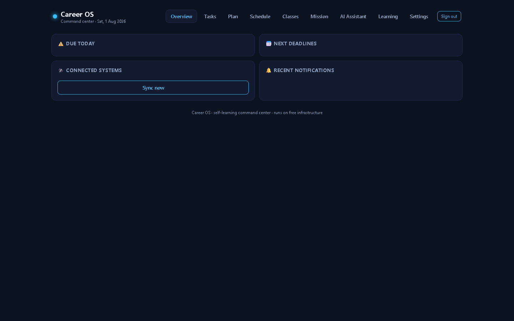
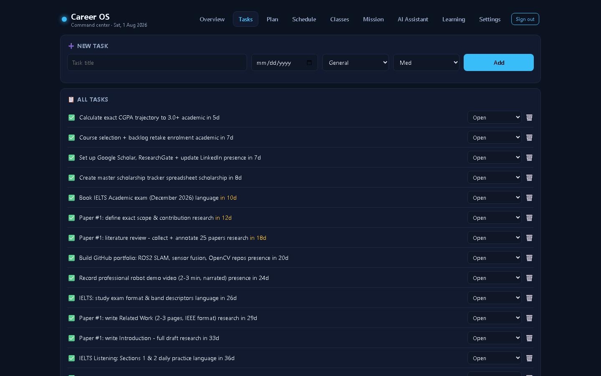
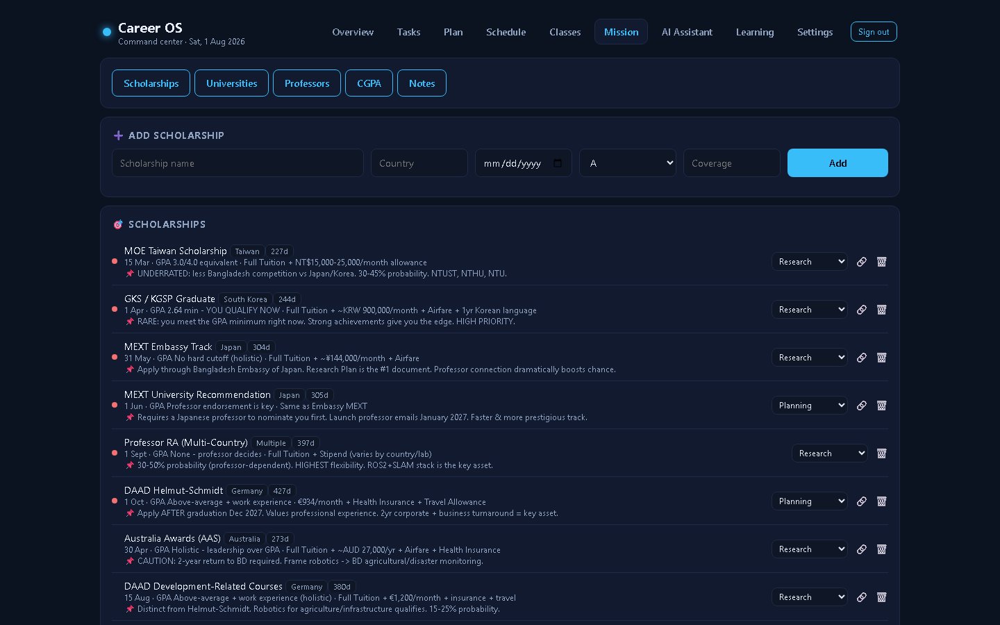
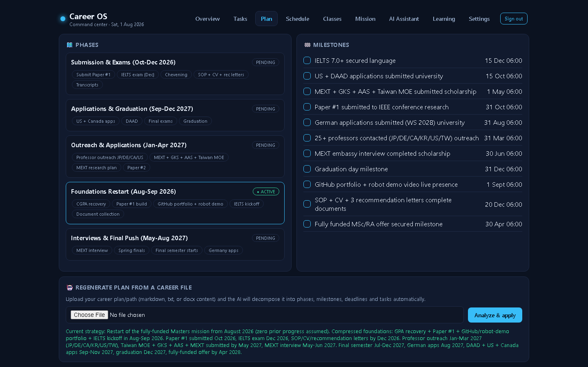
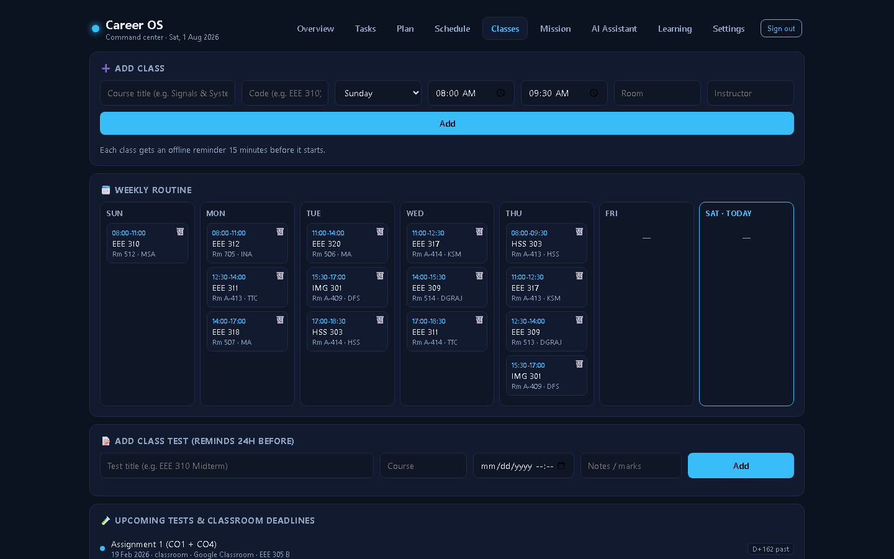
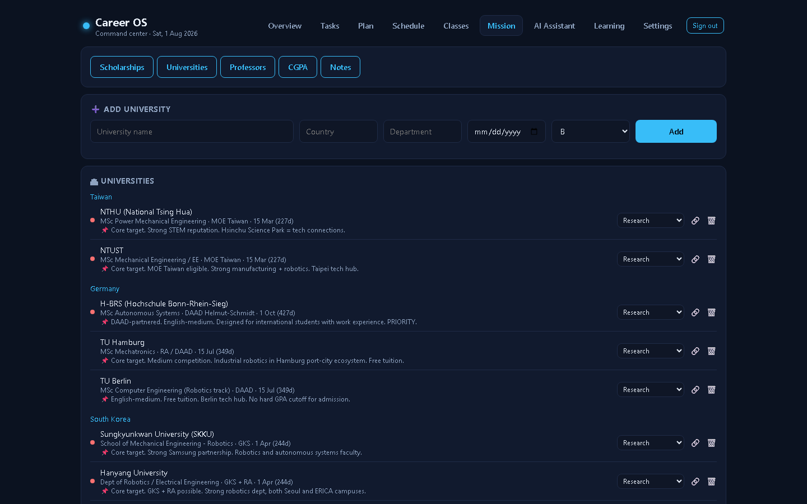
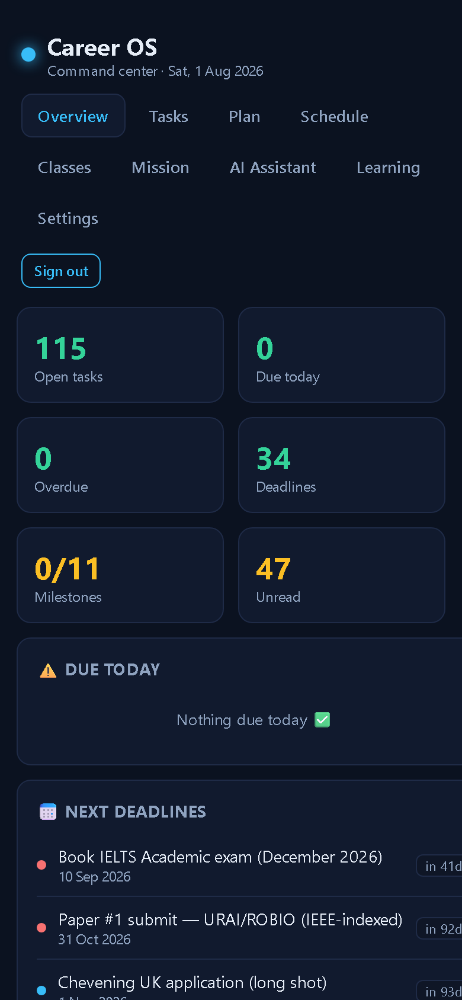
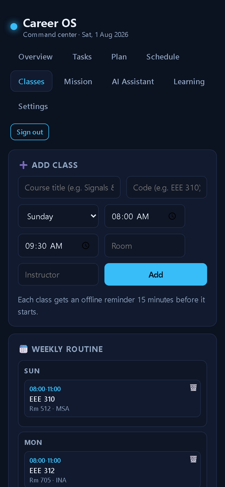
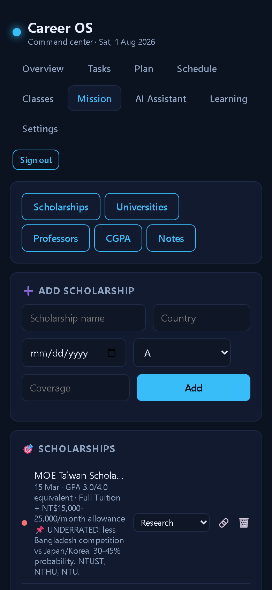

# Career OS — Autonomous Career Command Center

**Career OS** is a personal, self-learning career command center that unifies every automation system built by **Sadnan Sajid** (Robotics & Embedded AI Researcher, UAP EEE) into a single dashboard, AI assistant, and Android app. It plans, tracks and nudges a fully-funded MSc/RA mission in Robotics / Autonomous Systems toward a **2028 intake**, restarting in **August 2026**.

> Monorepo containing the **backend + web dashboard** (`api/`, `public/`) and the **Android companion app** (`android/`).

---

## 📸 Screenshots

**Web dashboard** (desktop)

| Overview | Tasks | Mission — Scholarships |
| --- | --- | --- |
|  |  |  |

| Plan | Classes (routine) | Mission — Universities |
| --- | --- | --- |
|  |  |  |

**Android app** (WebView — phone viewport)

| Overview | Classes | Mission |
| --- | --- | --- |
|  |  |  |

*More views: [Schedule](docs/screenshots/dashboard-schedule.png), [AI Assistant](docs/screenshots/dashboard-ai.png), [Learning](docs/screenshots/dashboard-learning.png), [Settings](docs/screenshots/dashboard-settings.png), [CGPA](docs/screenshots/dashboard-mission-cgpa.png), [Professors](docs/screenshots/dashboard-mission-professors.png)*

---

## ✨ What it does

| Feature | Details |
| --- | --- |
| **Unified dashboard** | Web + Android view of all personal automation systems: robowatch, EEE_Academic_OS, robot-oda-dashboard, career-intelligence-agent-os, news-pulse, Google Classroom |
| **AI assistant "Pulse"** | Gemini Flash agent with tool-calling; knows the full profile, plan, deadlines, class routine and learned facts |
| **Self-learning** | Every task completion, rating and correction is stored, distilled into *learned facts* (monthly), and injected into every AI answer |
| **Mission plan (restarted Aug 2026)** | 115 tasks, 20 deadlines, 11 milestones, 5 phases; end goal unchanged (fully-funded offer 2028) |
| **Mission trackers** | Scholarships (11), Universities (25), Professors (20), CGPA simulator, Notes — all editable |
| **Class routine** | Weekly timetable with **offline reminders 15 min before each class** |
| **Class tests & deadlines** | **24-hour-before reminders** for every deadline / class test |
| **Google Classroom connector** | OAuth sync of courses, assignments (→ deadlines + 24h reminders) and announcements |
| **Push + offline notifications** | FCM push + Android `AlarmManager` reminders that fire even offline, re-armed after reboot |
| **100% free infrastructure** | Firebase (Firestore + Auth + FCM) + Vercel (API + web) + GitHub Actions (scheduler + APK builds) |

---

## 🏗 System architecture

```
┌─────────────────────────────────────────────────────────────────────┐
│  GitHub Actions (scheduler.yml — every 30 min)                      │
│    • fetches robowatch / EEE_Academic_OS / news-pulse raw data      │
│    • POSTs to hub cron + connector endpoints                        │
└───────────────┬─────────────────────────────────────────────────────┘
                ▼
┌─────────────────────────────────────────────────────────────────────┐
│  Vercel — Express API  (api/index.js, serverless)                   │
│  • REST endpoints for tasks/deadlines/milestones/phases/goals       │
│  • Mission trackers: scholarships/universities/professors/CGPA/notes│
│  • Class schedule + reminder engine (15-min & 24-h offline alarms)  │
│  • Google Classroom OAuth + sync                                   │
│  • Gemini "Pulse" agent (tool-calling, up to 8 rounds)              │
│  • Self-learning: learning_events → learning_facts                  │
│  • FCM push via Firebase Admin                                      │
└──────┬───────────────────┬──────────────────────┬───────────────────┘
       │                   │                      │
       ▼                   ▼                      ▼
  Firestore            Gemini API            Google Classroom API
 (career-os-hub,   (generativelanguage.    (OAuth 2.0, read-only
  rules = deny)     googleapis.com)          scopes)
       │
       ▼
┌─────────────────────────────────────────────────────────────────────┐
│  Clients                                                             │
│  • Web dashboard (public/index.html — SPA, token auth)              │
│  • Android app (android/ — WebView + FCM + offline AlarmManager)    │
└─────────────────────────────────────────────────────────────────────┘
```

Key design decisions:
- **Firestore rules deny everything** (`allow read, write: if false`) — the server is the only actor, protected by a single shared `hubToken` (sent as `x-hub-token`).
- **Single token auth** shared by dashboard (localStorage), Android (SharedPreferences) and GitHub Actions (secret `HUB_TOKEN`).
- **Self-learning loop**: task completions / feedback / corrections → `learning_events` → monthly Gemini distillation → `learning_facts` → injected into the agent prompt.
- **Offline reminders**: the hub generates reminders; the app polls every 15 min and schedules exact `AlarmManager` alarms (re-armed on boot).
- **Timezone**: everything is computed in **Asia/Dhaka (UTC+6)** timezone-safe helpers (`api/lib/util.js`).

See **[docs/architecture.md](docs/architecture.md)** for a deeper walkthrough.

---

## 📁 Repository structure

```
career-os/
├── api/                     # Backend (Vercel serverless Express app)
│   ├── index.js             # All REST routes, auth, cron endpoints
│   └── lib/
│       ├── util.js          # Firestore helpers + Dhaka timezone math
│       ├── config.js        # Settings store (env fallback)
│       ├── profile.js       # Owner profile (injected into agent)
│       ├── seed.js          # Original roadmap seed data
│       ├── plan.js          # Aug-2026 restart plan (tasks/deadlines/milestones)
│       ├── mission.js       # Scholarships / universities / professors / CGPA / notes seed
│       ├── reminders.js     # Class (15-min) + deadline (24-h) reminder generators
│       ├── classroom.js     # Google Classroom OAuth + sync
│       ├── connectors.js    # External system connectors (career-io, robot-oda, classroom)
│       └── gemini.js        # Gemini client, tool definitions, system prompt
├── public/                  # Web dashboard (single-file SPA)
├── android/                 # Android companion app (Kotlin)
│   ├── app/                 #   Main module (WebView + FCM + alarms)
│   └── build.gradle         #   Gradle build (signed release via CI secrets)
├── docs/
│   ├── architecture.md      # Deep architecture + data model + flows
│   └── deployment.md        # Vercel / Firebase / Google Classroom / CI setup
├── .github/workflows/
│   ├── scheduler.yml        # Cron scheduler + external connector fetcher
│   └── android-build.yml    # Signed APK build on push / tags / releases
├── scripts/                 # Local dev/ops scripts (firebase OAuth, testing)
├── vercel.json              # Vercel rewrites for /api/*
├── package.json             # Backend dependencies (Node 20)
└── firestore.rules          # Deny-all security rules
```

---

## 🛠 Tech stack

| Layer | Technology |
| --- | --- |
| Backend | Node.js 20, Express, `firebase-admin` |
| Database | Firestore (rules: deny-all) |
| AI | Google Gemini Flash (`gemini-flash-latest`) with function calling |
| Auth | Single shared hub token (`x-hub-token` header) |
| Frontend | Vanilla JS SPA (no framework) |
| Android | Kotlin, Jetpack (WebView, WorkManager, AlarmManager), Firebase Messaging |
| Push | Firebase Cloud Messaging |
| OAuth | Google Classroom API (read-only scopes, refresh token stored server-side) |
| Deploy | Vercel (API + static), GitHub Actions (scheduler + APK) |

---

## 🚀 Quick start (development)

**Backend + dashboard**
```bash
npm install
cp .env.example .env        # FIREBASE_SERVICE_ACCOUNT, GEMINI_API_KEY (optional)
vercel dev                  # serves api/ + public/ at http://localhost:3000
```

**Android app**
```bash
cd android
gradle assembleDebug        # or: assembleRelease with KEYSTORE_* env vars
```
APKs are also built automatically by `.github/workflows/android-build.yml` and published as GitHub Releases (`v*` tags).

See **[docs/deployment.md](docs/deployment.md)** for full setup: Firebase project, Vercel env vars, hub-token bootstrap, Google Classroom OAuth, and CI secrets.

---

## 🔐 Security notes

- The Firestore database is **locked down** (`firestore.rules` deny-all); all access goes through the server.
- All secrets live in **Vercel env vars / GitHub secrets**, never in the repo:
  `FIREBASE_SERVICE_ACCOUNT`, `GEMINI_API_KEY`, `HUB_TOKEN`, `KEYSTORE_BASE64`, `KEYSTORE_PASS`, `KEY_PASS`, `KEY_ALIAS`.
- The `google-services.json` **Android API key** is *not a secret* (it ships inside the APK). It must be protected by an **Android application restriction** in Google Cloud (package `com.sadnan.careeros` + signing SHA-1). See **[docs/deployment.md](docs/deployment.md)**.
- The Google Classroom OAuth **refresh token** is stored in Firestore settings (server-side only, never returned by the API).
- The GitHub Actions scheduler authenticates via the `HUB_TOKEN` secret.

---

## 📚 Further reading

- [docs/architecture.md](docs/architecture.md) — architecture, data model, flows
- [docs/deployment.md](docs/deployment.md) — deployment & credentials
- [android/README.md](android/README.md) — Android app build & install
- [Mission plan](api/lib/plan.js) — the Aug-2026 restart plan (115 tasks, 20 deadlines)

---

## 📄 License

Private / personal project. Not licensed for redistribution.
